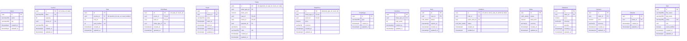

```mermaid
erDiagram
    Venue {
      uuid id PK
      varchar(255) name
      varchar(255) city
      timestamptz created_at
      timestamptz updated_at
    }
    Section {
      uuid id PK "UK (venue_id, label)"
      varchar(255) label UK
      int capacity
      uuid venue_id FK
      varchar(255) type
      timestamptz created_at
      timestamptz updated_at
    }
    Seat {
      uuid id PK
      uuid section_id FK "UK (section_id, row_no, seat_number)"
      int row_no UK
      int seat_number UK
      timestamptz created_at
      timestamptz updated_at
    }
    EventSeat {
      uuid id PK "UK (seat_id, event_id)"
      uuid event_id FK, UK
      uuid seat_id FK, UK
      uuid ticket_type_id FK
      timestamptz created_at
      timestamptz updated_at
    }
    Event {
      uuid id PK
      uuid venue_id FK
      varchar(255) artist
      timestamptz starts_at
      timestamptz ends_at
      timestamptz created_at
      timestamptz updated_at
    }
    Ticket {
      uuid id PK "UK (payment_id, seat_id, event_id, code)"
      uuid ticket_type_id FK
      numeric ticket_price
      uuid seat_id FK, UK
      uuid event_id FK, UK
      uuid payment_id FK
      varchar(3) currency
      varchar(255) code UK
      timestamptz created_at
      timestamptz updated_at
    }
    TicketPrice {
      uuid id PK "UK(ticket_type_id, event_id)"
      uuid ticket_type_id FK, UK
      uuid event_id FK, UK
      numeric price
      varchar(3) currency
      timestamptz created_at
      timestamptz updated_at
    }
    TicketType {
      uuid id PK
      varchar(255) type
      timestamptz created_at
      timestamptz updated_at
    }
    Inventory {
      uuid id PK
      uuid ticket_type_id FK
      int total_seats
      timestamptz created_at
      timestamptz updated_at
    }
    Hold {
      uuid id PK
      uuid user_id FK
      hold_status status
      timestamptz expires_at
      timestamptz created_at
      timestamptz updated_at
    }
    HoldItem {
      uuid id PK "UK active: event_seat_id, partial by status"
      uuid hold_id FK
      uuid event_seat_id FK
      hold_item_status status
      timestamptz created_at
      timestamptz updated_at
    }
    Order {
      uuid id PK
      order_status status
      numeric total_price
      varchar(3) currency
      timestamptz created_at
      timestamptz updated_at
    }
    OrderItem {
      uuid id PK
      uuid order_id FK
      numeric price
      varchar(3) currency
      int quantity
      timestamptz created_at
      timestamptz updated_at
    }
    Payment {
      uuid id PK
      uuid order_id FK
      numeric price
      varchar(3) currency
      timestamptz created_at
      timestamptz updated_at
    }
    CheckIn {
      uuid id PK
      uuid ticket_id FK
      timestamptz created_at
      timestamptz updated_at
    }
    User {
      uuid id PK
      varchar(255) first_name
      varchar(255) last_name
      varchar(255) email UK
      role role
      boolean email_verified
      timestamptz created_at
      timestamptz updated_at
    }
```
