```mermaid
erDiagram
    Venue ||--o{ Section : "has"
    Venue ||..o{ Event : "hosts"
    Section ||--o{ Seat : "has"
    Section ||--o{ TicketAllocation : "sold as quota in"
    Event ||--o{ TicketType : "offers"
    Event ||--o{ EventSeat : "puts on sale"
    Event ||--o{ TicketAllocation : "puts on sale"
    Seat ||--o{ EventSeat : "put on sale as"
    TicketType ||..o{ EventSeat : "priced as"
    TicketType ||..o{ TicketAllocation : "priced as"
    TicketType ||..o{ Ticket : "priced as"
    User ||..o{ Hold : "holds"
    Hold ||--o{ HoldSeatItem : "holds seat by"
    Hold ||--o{ HoldAllocatedItem : "holds quota by"
    Hold ||..o| Order : "confirmed into"
    EventSeat ||..o{ HoldSeatItem : "held by"
    TicketAllocation ||..o{ HoldAllocatedItem : "held by"
    Order ||--o{ OrderItem : "contains"
    Order ||--o{ Payment : "paid by"
    EventSeat |o..o{ OrderItem : "ordered as"
    TicketAllocation |o..o{ OrderItem : "ordered as"
    Payment ||..o{ Ticket : "issues"
    EventSeat |o..o| Ticket : "sold as"
    TicketAllocation |o..o{ Ticket : "sold as"
    Ticket ||--o| CheckIn : "burnt by"
    Currency ||..o{ TicketType : "prices"
    Currency ||..o{ Order : "prices"
    Currency ||..o{ OrderItem : "prices"
    Currency ||..o{ Payment : "prices"
    Currency ||..o{ Ticket : "prices"
    Venue {
      uuid id PK
      varchar(255) name
      varchar(255) city
      timestamptz created_at
      timestamptz updated_at
    }
    Section {
      uuid id PK "UK (venue_id, label), (id, type), (id, capacity)"
      varchar(255) label UK
      int capacity
      uuid venue_id FK
      section_type type
      timestamptz created_at
      timestamptz updated_at
    }
    Seat {
      uuid id PK
      uuid section_id FK "UK (section_id, row_no, seat_number), CHECK section_type = 'numbered'"
      int row_no UK
      int seat_number UK
      section_type section_type FK "(section_id, section_type)"
      timestamptz created_at
      timestamptz updated_at
    }
    EventSeat {
      uuid id PK "aggregate root: EventSeat; UK (seat_id, event_id)"
      uuid event_id FK, UK
      uuid seat_id FK, UK
      uuid ticket_type_id FK
      timestamptz created_at
      timestamptz updated_at
    }
    Event {
      uuid id PK
      uuid venue_id FK
      varchar(255) artist
      timestamptz starts_at
      timestamptz ends_at
      timestamptz created_at
      timestamptz updated_at
    }
    TicketType {
      uuid id PK "UK (event_id, type)"
      varchar(255) type
      uuid event_id FK
      numeric price
      char(3) currency FK
      timestamptz created_at
      timestamptz updated_at
    }
    TicketAllocation {
      uuid id PK "aggregate root: TicketAllocation; UK(event_id, section_id), CHECK section_type = 'standing'"
      uuid event_id FK
      uuid section_id FK
      uuid ticket_type_id FK
      section_type section_type FK "(section_id, section_type)"
      int section_capacity FK "(section_id, section_capacity) ON UPDATE CASCADE, CHECK capacity <= section_capacity"
      int sold
      int held
      int capacity
      timestamptz created_at
      timestamptz updated_at
    }
    Hold {
      uuid id PK "aggregate root: Hold"
      uuid user_id FK
      hold_status status
      timestamptz expires_at
      timestamptz created_at
      timestamptz updated_at
    }
    HoldSeatItem {
      uuid id PK "part of Hold; UK active: event_seat_id, partial by status"
      uuid hold_id FK
      uuid event_seat_id FK
      hold_item_status status
      timestamptz created_at
      timestamptz updated_at
    }
    HoldAllocatedItem {
      uuid id PK "part of Hold; UK active: hold_id, allocation_id, partial by status"
      uuid hold_id FK
      uuid allocation_id FK
      int quantity
      hold_item_status status
      timestamptz created_at
      timestamptz updated_at
    }
    Order {
      uuid id PK "aggregate root: Order; UK (id, currency)"
      uuid hold_id FK, UK
      order_status status
      char(3) currency FK
      timestamptz created_at
      timestamptz updated_at
    }
    OrderItem {
      uuid id PK "part of Order; CHECK num_nonnulls(event_seat_id, allocation_id) = 1"
      uuid order_id FK
      uuid event_seat_id FK
      uuid allocation_id FK
      int quantity "CHECK quantity = 1 for seat, >= 1 for quota"
      numeric price
      char(3) currency FK "(order_id, currency)"
      timestamptz created_at
      timestamptz updated_at
    }
    Payment {
      uuid id PK "part of Order; UK (id, status), (id, currency)"
      uuid order_id FK "UK succeeded: order_id, partial by status"
      payment_status status
      varchar(255) idempotency_key UK
      numeric price
      char(3) currency FK "(order_id, currency)"
      timestamptz created_at
      timestamptz updated_at
    }
    Ticket {
      uuid id PK "aggregate root: Ticket; UK sold: event_seat_id, partial WHERE not null"
      uuid payment_id FK "(payment_id, payment_status) to payment (id, status)"
      payment_status payment_status "CHECK payment_status = 'succeeded'"
      uuid event_seat_id FK "CHECK num_nonnulls(event_seat_id, allocation_id) = 1"
      uuid allocation_id FK
      uuid ticket_type_id FK
      numeric ticket_price
      char(3) currency FK
      varchar(255) code UK
      timestamptz created_at
      timestamptz updated_at
    }
    CheckIn {
      uuid id PK "part of Ticket"
      uuid ticket_id FK, UK
      timestamptz created_at
      timestamptz updated_at
    }
    Currency {
      char(3) code PK
      varchar(255) name
    }
    User {
      uuid id PK
      varchar(255) first_name
      varchar(255) last_name
      varchar(255) email UK
      role role
      boolean email_verified
      timestamptz created_at
      timestamptz updated_at
    }
```

## Агрегаты

Граница помечена комментарием у первичного ключа (решение 10): `aggregate root: X` у корня,
`part of X` у сущности внутри. Пять агрегатов из [CONTEXT.md](../../CONTEXT.md):

| Агрегат (root)       | Таблицы внутри                             | Рядом, но снаружи — ссылка по id                            |
| -------------------- | ------------------------------------------ | ------------------------------------------------------------- |
| **EventSeat**        | `event_seat`                               | `seat`, `event`, `ticket_type`, `hold_seat_item`, `ticket`    |
| **TicketAllocation** | `ticket_allocation`                        | `event`, `section`, `ticket_type`, `hold_allocated_item`      |
| **Hold**             | `hold`, `hold_seat_item`, `hold_allocated_item` | `user`, `event_seat`, `ticket_allocation`, `order`       |
| **Order**            | `order`, `order_item`, `payment`           | `hold`, `event_seat`, `ticket_allocation`, `ticket`           |
| **Ticket**           | `ticket`, `check_in`                       | `payment`, `event_seat`, `ticket_allocation`, `ticket_type`   |

**Сущности без пометки живут вне агрегатов** — `venue`, `section`, `seat`, `ticket_type`,
`currency`, `user`. Это не упущение: они не защищают инвариантов при записи, и по разделу
«Где DDD не применяется» им положен обычный CRUD.

Два места, где граница проведена сознательно и будет обосновываться в `M1-13`:

- **Инвариант `EventSeat` держится строкой чужого агрегата.** «Место удерживается не более
  чем одним активным Hold» физически стоит на `hold_seat_item`, а тот лежит внутри `Hold` —
  так решено, чтобы у `Hold` осталось что проверять для инварианта «Hold непустой». Это и есть
  «главное напряжение проекта» из `CONTEXT.md`, только увиденное со стороны схемы.
- **`payment` внутри `Order`.** Словарь кладёт платежи в заказ, и правила «оплаченный нельзя
  оплатить второй раз» и «нельзя вернуть неоплаченный» живут с ним в одном агрегате. Цена:
  webhook провайдера, меняющий статус платежа, приходит извне и в чужой момент времени, а
  писать обязан через агрегат `Order`.

## Инварианты

Чем держится каждый инвариант из таблицы «Агрегаты и их инварианты» — в
[states-and-invariants.md](./states-and-invariants.md), раздел «Пункт 10». Там же расписаны
состояния `hold_status`, `hold_item_status`, `payment_status`, `order_status` с разрешёнными
переходами и все принятые решения по схеме с их ценой.

Коротко: из инвариантов `CONTEXT.md` схемой держатся все, кроме шести. Четыре живут в коде
агрегата осознанно — «Hold непустой» и «истёкший Hold нельзя подтвердить» невыразимы в
принципе, переходы `Order.status` enum не описывает, возврата в `M1` нет. Пятый —
совпадение валюты билета с валютой платежа — оставлен тесту, чтобы не вешать второй составной
ключ на ту же таблицу. Шестой снят вместе с колонкой: `total` не хранится.
